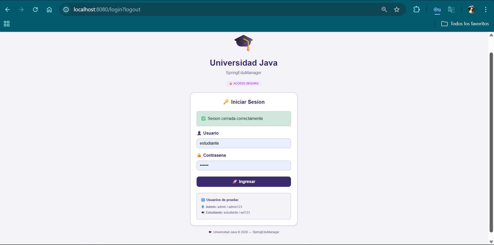
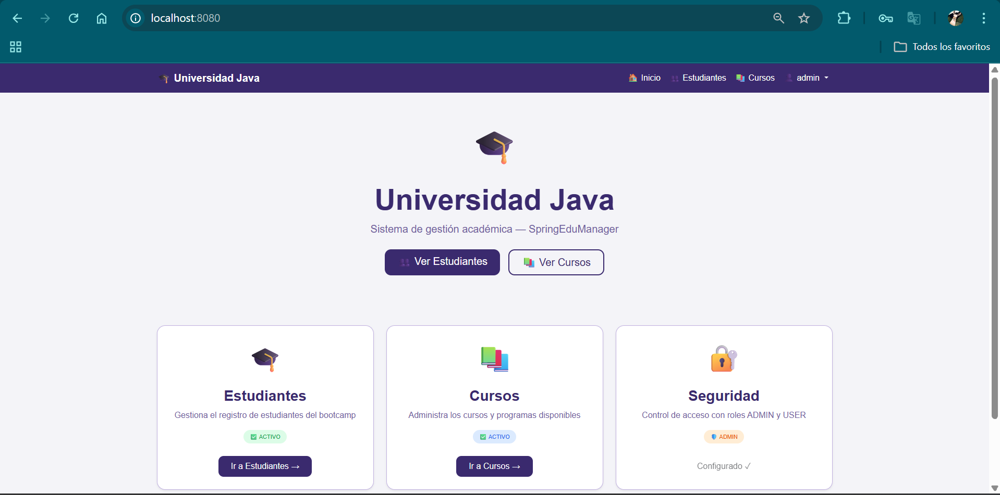
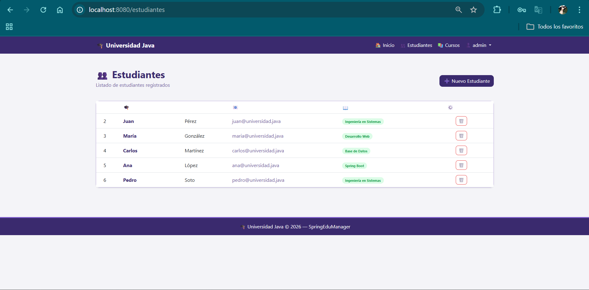
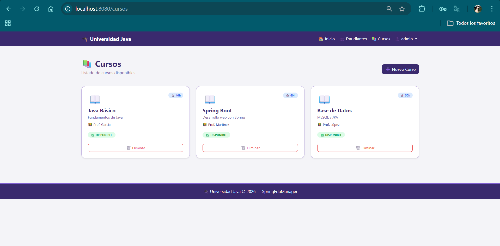

# 🎓 SpringEduManager — Universidad Java

Sistema de gestión académica desarrollado con **Spring Boot** para el bootcamp de programación de Universidad Java.


## 📋 Descripción

SpringEduManager es una aplicación web educativa que permite gestionar estudiantes, cursos y evaluaciones. Fue desarrollada como proyecto de evaluación del **Módulo 6: Desarrollo de aplicaciones JEE con Spring Framework**.


## 📁 Estructura del proyecto
```
springedumanager/
├── src/main/java/com/springedu/springedumanager/
│   ├── controller/          ← Controladores MVC y REST
│   │   ├── HomeController.java
│   │   ├── EstudianteController.java
│   │   ├── CursoController.java
│   │   ├── LoginController.java
│   │   ├── EstudianteRestController.java
│   │   └── CursoRestController.java
│   ├── model/               ← Entidades JPA
│   │   ├── Estudiante.java
│   │   └── Curso.java
│   ├── repository/          ← Repositorios JPA
│   │   ├── EstudianteRepository.java
│   │   └── CursoRepository.java
│   ├── service/             ← Lógica de negocio
│   │   ├── EstudianteService.java
│   │   └── CursoService.java
│   └── security/            ← Configuración de seguridad
│       └── SecurityConfig.java
├── src/main/resources/
│   ├── templates/           ← Vistas Thymeleaf
│   │   ├── index.html
│   │   ├── login.html
│   │   ├── estudiantes/
│   │   │   ├── lista.html
│   │   │   └── formulario.html
│   │   └── cursos/
│   │       ├── lista.html
│   │       └── formulario.html
│   └── application.properties
└── pom.xml
```

---

## ⚙️ Configuración

### Requisitos previos
- Java 21 o superior
- MySQL 8.x
- Maven 3.x

### Base de datos
Crea la base de datos en MySQL:
```sql
CREATE DATABASE springedumanager;
```

O configura el `application.properties` con `createDatabaseIfNotExist=true` para que se cree automáticamente.

### application.properties
```properties
spring.datasource.url=jdbc:mysql://localhost:3306/springedumanager?createDatabaseIfNotExist=true
spring.datasource.username=root
spring.datasource.password=tu_password
spring.jpa.hibernate.ddl-auto=update
```


## ▶️ Cómo ejecutar
```bash
# Clonar el repositorio
git clone https://github.com/tu-usuario/springedumanager.git

# Entrar al proyecto
cd springedumanager

# Ejecutar
mvnw.cmd spring-boot:run
```

Abrir en el navegador: `http://localhost:8080`

---

## 👤 Usuarios de prueba

| Usuario | Contraseña | Rol |
|---|---|---|
| admin | admin123 | ADMIN |
| estudiante | est123 | USER |

---

## 🌐 Endpoints REST

| Método | URL | Descripción |
|---|---|---|
| GET | /api/estudiantes | Listar estudiantes |
| POST | /api/estudiantes | Crear estudiante |
| DELETE | /api/estudiantes/{id} | Eliminar estudiante |
| GET | /api/cursos | Listar cursos |
| POST | /api/cursos | Crear curso |
| PUT | /api/cursos/{id} | Actualizar curso |
| DELETE | /api/cursos/{id} | Eliminar curso |

---

## 🔐 Roles y permisos

| Acción | ADMIN | USER |
|---|---|---|
| Ver estudiantes | ✅ | ✅ |
| Agregar estudiante | ✅ | ❌ |
| Eliminar estudiante | ✅ | ❌ |
| Ver cursos | ✅ | ✅ |
| Agregar curso | ✅ | ❌ |
| Eliminar curso | ✅ | ❌ |

---

## 📸 Capturas de pantalla

### Login


### Inicio


### Estudiantes


### Cursos


---

## 👨‍💻 Autor

**Jocelyn** — Universidad Java  
Módulo 6: Desarrollo de aplicaciones JEE con Spring Framework  
2026